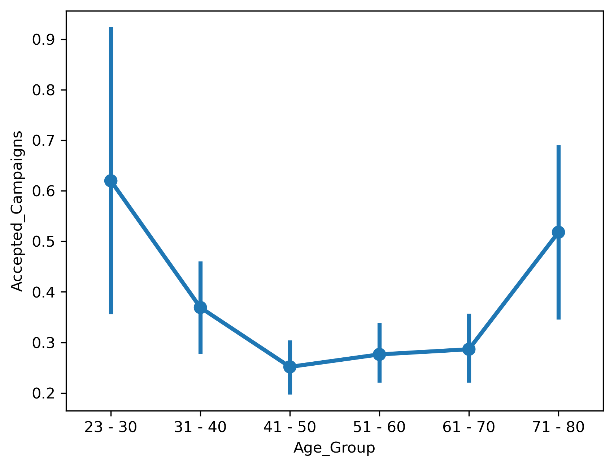
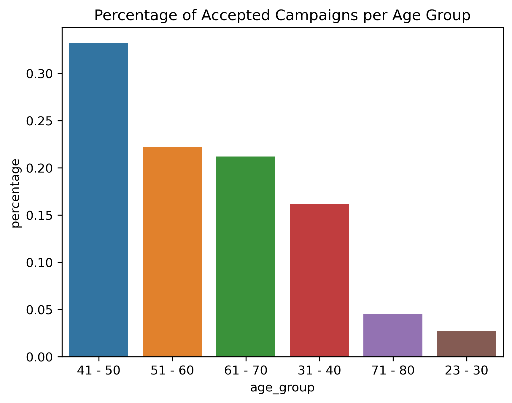
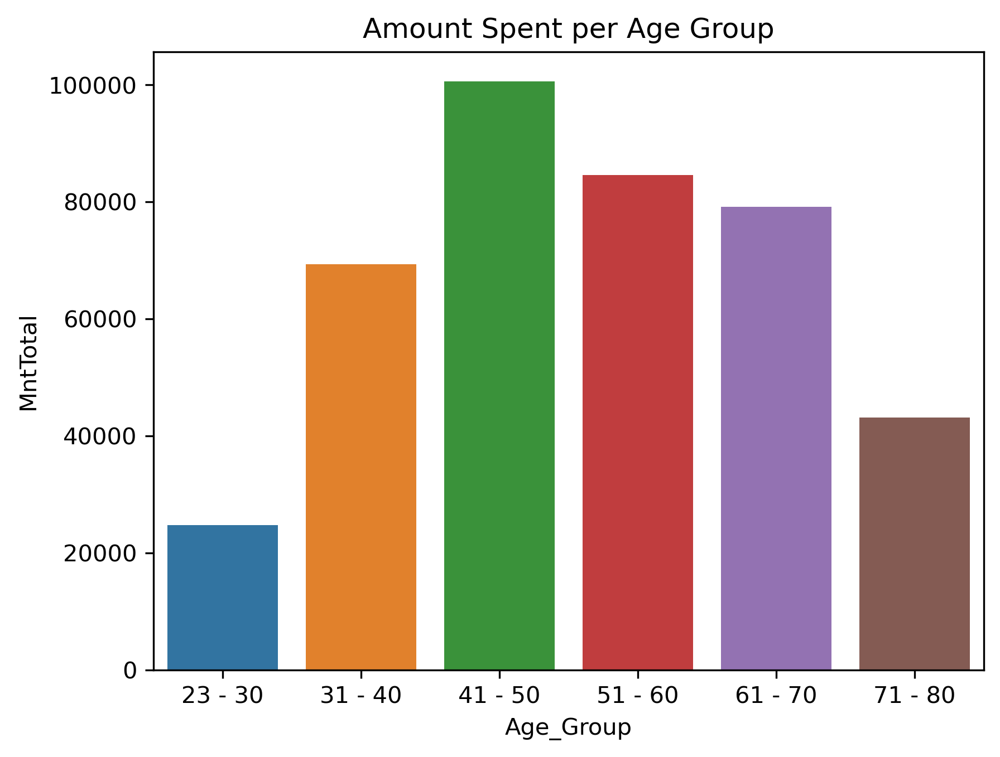
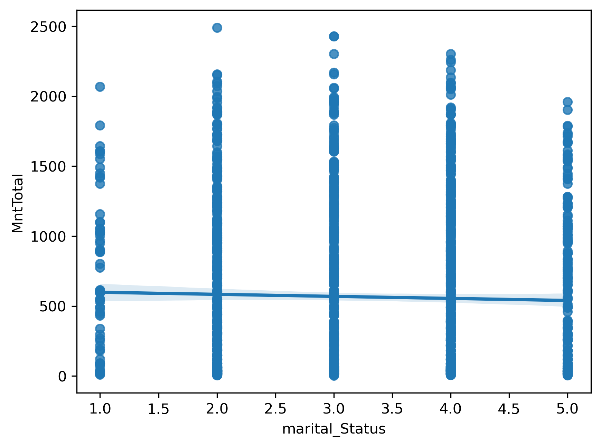
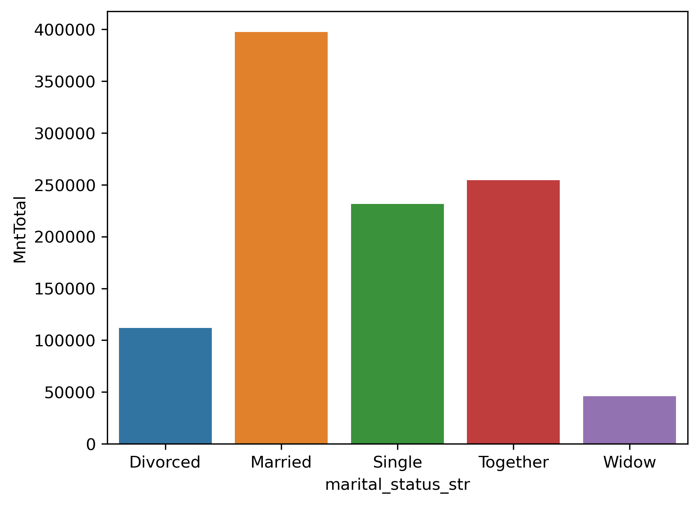
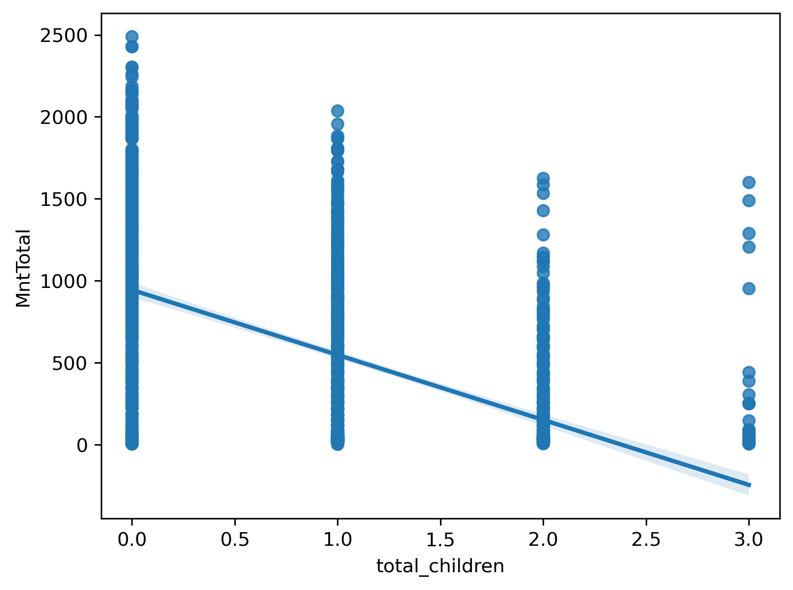

# UFood Marketing Analysis (Pandas Project)

## Project Overview
This project analyzes customer and marketing campaign data from **UFood**, a food-related company, to understand **who spends the most money**, **which customers are most likely to accept marketing campaigns**, and **which sales channels perform best**.

Using exploratory data analysis (EDA) and visualization, the goal is to translate raw customer data into **actionable marketing recommendations**.

---

## Raw Data
- [Download ufood_marketing_raw.csv](u_food_marketing.csv)

---

## Completed Jupyter Notebook
- The completed Jupyter notebook can be downloaded from this repository.

---

## Key Questions
- Which age groups generate the highest spending?
- Which customer segments are most likely to accept marketing campaigns?
- How do different sales channels (catalog, in-store, etc.) compare?
- How do household and relationship factors (kids, marital status) influence spending behavior?

---

## Tools & Libraries
- Python  
- Pandas  
- Matplotlib  
- Seaborn  
- Jupyter Notebook  

---

## Dataset
The dataset contains anonymized customer marketing data, including:
- Age and age group  
- Marital status  
- Household composition (children)  
- Sales channel usage  
- Campaign acceptance  
- Customer spending behavior  

---

## Analysis Workflow

### 1. Data Preparation
- Loaded and inspected the dataset using Pandas  
- Created grouped variables (e.g., age groups)  
- Cleaned data by removing duplicates  
- Aggregated spending and campaign acceptance metrics  

### 2. Exploratory Data Analysis
- Compared spending behavior across age groups  
- Analyzed campaign acceptance rates by demographic segment  
- Evaluated performance differences across sales channels  
- Visualized patterns using bar plots and summary statistics  

---

## Visual Analysis & Insights

### Campaign Acceptance by Age Group





These visualizations show that younger customers (ages **23–30**) accept campaigns at a higher rate, while middle-aged customers represent a larger share of overall spending but are less responsive.

---

### Spending Behavior by Demographic Group

#### Amount Spent per Age Group


#### Spending by Marital Status




#### Spending by Household Composition


These plots highlight that **customers without children** and those who are **married, single, or together** generate the most revenue.

---

### Sales Channel Performance


This visualization compares customer spending across different sales channels, revealing important trade-offs between volume and effectiveness.

---

## Key Findings
- Ages **31–70** account for the **highest overall spending**, but are **less likely to accept marketing campaigns** compared to younger customers.
- **Catalog customers** are more likely to accept campaigns, while **in-person shoppers spend more per customer**.
- Customers **without children** tend to spend more than those with kids.
- **Married, single, and “together” customers** generate the most revenue overall.
- Divorced and widowed segments contribute less and may not be optimal targets for prioritization.

---

## Final Recommendation
Focus marketing efforts on **middle-aged customers without children**, while maintaining a **balanced channel strategy**:
- Use **catalog campaigns** for higher acceptance rates  
- Continue **in-person engagement** to maximize spending  
- Avoid over-prioritizing lower-return demographic segments  
- To grow new users, target customers aged **23–30**, who accept campaigns at higher rates but currently represent a smaller share of total spending  

---

## How to Run
1. Install dependencies:
   ```bash
   pip install pandas matplotlib seaborn

